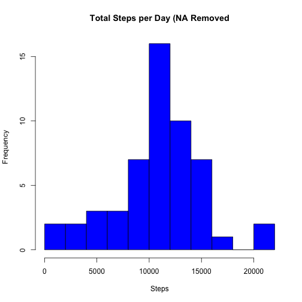
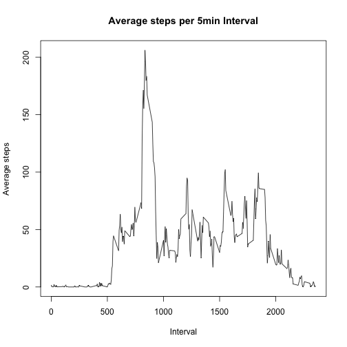
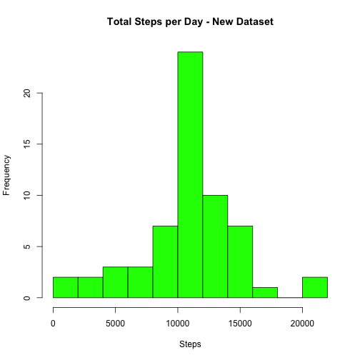

# Introduction
t is now possible to collect a large amount of data about personal movement using activity monitoring devices such as a Fitbit, Nike Fuelband, or Jawbone Up. These type of devices are part of the “quantified self” movement – a group of enthusiasts who take measurements about themselves regularly to improve their health, to find patterns in their behavior, or because they are tech geeks. But these data remain under-utilized both because the raw data are hard to obtain and there is a lack of statistical methods and software for processing and interpreting the data.

This assignment makes use of data from a personal activity monitoring device. This device collects data at 5 minute intervals through out the day. The data consists of two months of data from an anonymous individual collected during the months of October and November, 2012 and include the number of steps taken in 5 minute intervals each day.

The data for this assignment can be downloaded from the course web site:

Dataset: Activity monitoring data [52K]
The variables included in this dataset are:

steps: Number of steps taking in a 5-minute interval (missing values are coded as \color{red}{\verb|NA|}NA)
date: The date on which the measurement was taken in YYYY-MM-DD format
interval: Identifier for the 5-minute interval in which measurement was taken

## Assignment
This assignment will be described in multiple parts. You will need to write a report that answers the questions detailed below. Ultimately, you will need to complete the entire assignment in a single R markdown document that can be processed by knitr and be transformed into an HTML file.

Throughout your report make sure you always include the code that you used to generate the output you present. When writing code chunks in the R markdown document, always use \color{red}{\verb|echo = TRUE|}echo=TRUE so that someone else will be able to read the code. This assignment will be evaluated via peer assessment so it is essential that your peer evaluators be able to review the code for your analysis.

For the plotting aspects of this assignment, feel free to use any plotting system in R (i.e., base, lattice, ggplot2)

Fork/clone the GitHub repository created for this assignment. You will submit this assignment by pushing your completed files into your forked repository on GitHub. The assignment submission will consist of the URL to your GitHub repository and the SHA-1 commit ID for your repository state.


## Loading and preprocessing the data
This step will set working directory, load data and remove NA's & format date column


##What is mean total number of steps taken per day?
For this part of the assignment, missing values are ignored. 

1. Calculate the total number of steps taken per day


```r
## Total number of steps per day
totalsteps <- aggregate(activitydata["steps"],by=activitydata["date"],sum)
head(totalsteps)
```

```
##         date steps
## 1 2012-10-02   126
## 2 2012-10-03 11352
## 3 2012-10-04 12116
## 4 2012-10-05 13294
## 5 2012-10-06 15420
## 6 2012-10-07 11015
```
2. Make a histogram of the total number of steps taken each day


```r
hist(totalsteps$steps, breaks=10, xlab="Steps", col = "blue",main = "Total Steps per Day (NA Removed")
```



3.Calculate and report the mean and median of the total number of steps taken per day

```r
mean_of_steps <- mean(totalsteps$steps)
print(mean_of_steps)
```

```
## [1] 10766.19
```

```r
median_of_steps <- median(totalsteps$steps)
print(median_of_steps)
```

```
## [1] 10765
```

## What is the average daily activity pattern?
1. Make a time series plot (type="l") of the 5-minute interval (x-axis) and the average number of steps taken, averaged across all days (y-axis)


```r
meandatasteps <- aggregate(activitydata$steps,by=list(activitydata$interval),FUN=mean,rm.na=True)
colnames(meandatasteps) <- c("interval","steps")
plot(meandatasteps$interval,meandatasteps$steps,type="l",xlab = "Interval", ylab = "Average steps", main= "Average steps per 5min Interval")
```



2. Which 5-minute interval, on average across all the days in the dataset, contains the maximum number of steps?


```r
maxsteps <- max(meandatasteps$steps)
maxinterval <- meandatasteps[meandatasteps$steps==maxsteps,]
```
Following 5-minuite interval which contains max number of steps

```r
print(maxinterval)
```

```
##     interval    steps
## 104      835 206.1698
```

## Imputing missing values
Note that there are a number of days/intervals where there are missing values (coded as NA). The presence of missing days may introduce bias into some calculations or summaries of the data.

1. Calculate and report the total number of missing values in the dataset (NAs)


```r
## Total number of NAs
NAcount <- sum(is.na(rawdata$steps))
```
Total number of NAs are:

```r
print(NAcount)
```

```
## [1] 2304
```

2. Devise a strategy for filling in all of the missing values in the dataset. The strategy does not need to be sophisticated. For example, you could use the mean/median for that day, or the mean for that 5-minute interval, etc.

I will replace missing values with mean of the number of steps taken accross all days. All NAs will be replaced by following value

```r
## Calucate Mean of steps for all days
r_mean <- mean(meandatasteps$steps)
print(r_mean)
```

```
## [1] 37.3826
```
3. Create a new dataset that is equal to the original dataset but with the missing data filled in.

```r
## Replace NA in raw data with mean of steps accross all days
newdata <- rawdata
newdata[is.na(newdata)] <- r_mean
head(newdata)
```

```
##     steps       date interval
## 1 37.3826 2012-10-01        0
## 2 37.3826 2012-10-01        5
## 3 37.3826 2012-10-01       10
## 4 37.3826 2012-10-01       15
## 5 37.3826 2012-10-01       20
## 6 37.3826 2012-10-01       25
```
4. Make a histogram of the total number of steps taken each day and Calculate and report the mean and median total number of steps taken per day. Do these values differ from the estimates from the first part of the assignment? What is the impact of imputing missing data on the estimates of the total daily number of steps?

```r
## Caluate total steps per day with new dataset
newdata$date <- as.Date(newdata$date)
totalsteps_new <- aggregate(newdata["steps"],by=newdata["date"],sum)
hist(totalsteps_new$steps, breaks=10, xlab="Steps", col = "Green",main = "Total Steps per Day - New Dataset")
```



```r
## Calculate mean and median with new data
mean_of_steps_new <- mean(totalsteps_new$steps)
print(mean_of_steps_new)
```

```
## [1] 10766.19
```

```r
median_of_steps_new <- median(totalsteps_new$steps)
print(median_of_steps_new)
```

```
## [1] 10766.19
```
Overall dataset size has increased by the distribution does do not differ much from the first part of the assignment as NAs are substituted by mean of steps accross all days. 
## Are there differences in activity patterns between weekdays and weekends?
For this part the weekdays() function may be of some help here. Use the dataset with the filled-in missing values for this part.

1.Create a new factor variable in the dataset with two levels – “weekday” and “weekend” indicating whether a given date is a weekday or weekend day.

```r
## add 'day' column to new dataset
newdata$day <- ifelse(weekdays(as.Date(newdata$date)) == "Saturday" | weekdays(as.Date(newdata$date)) == "Sunday", "weekend", "weekday")
```
2. Make a panel plot containing a time series plot (type="l") of the 5-minute interval (x-axis) and the average number of steps taken, averaged across all weekday days or weekend days (y-axis). See the README file in the GitHub repository to see an example of what this plot should look like using simulated data.

```r
## create new dataset with mean steps for the 5-minute interval 
meandatasteps_new <- aggregate(newdata$steps,by=list(newdata$interval,newdata$day),FUN=mean,rm.na=True)
colnames(meandatasteps_new) <- c("interval","day","steps")
## use lattice library for plot
library(lattice)
xyplot(steps ~ interval | day, meandatasteps_new, type="l", lwd=1,  xlab="Interval", ylab="Number of steps", layout=c(1,2))
```


There is increased activity on weekends
